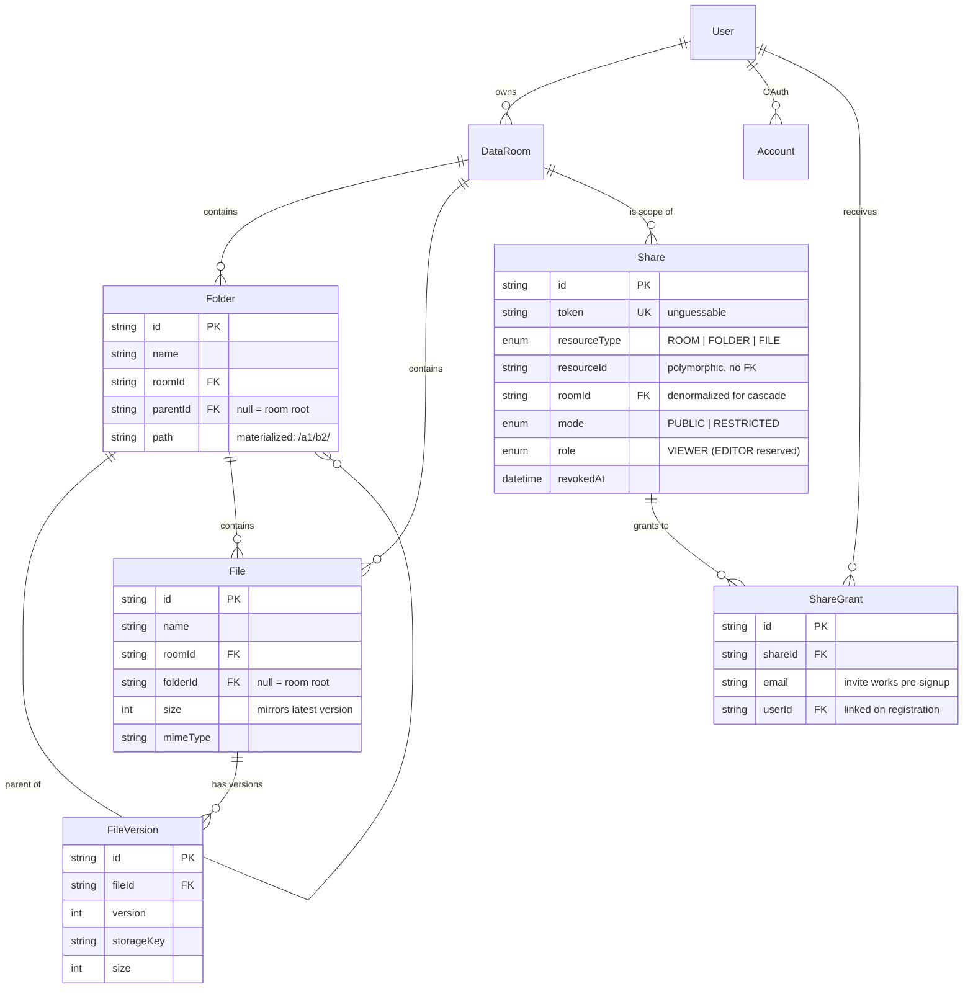

# Strongroom — Data Room MVP

Data room for due diligence: nested folders, versioned files, public/restricted
sharing with revocation. Take-home for the Acme Corp. acquisition scenario.

**Live:** https://dataroom-rosy.vercel.app
**Account:** register with any email/password, no invite needed.

---

## Implemented

**Folders** — create, nest, rename, delete. Breadcrumbs at every level.
Deleting one shows real subtree stats first (N folders, M files, size) before
anything happens.

**Files** — multi-file drag-and-drop upload with per-file progress, cancel,
and retry. PDF/image preview in-browser. Rename with conflict detection (409,
shown inline). Move via a folder-tree picker; a name clash in the destination
auto-suffixes. Delete removes every stored version too.

**Versioning (extra credit)** — uploading a name that already exists in a
folder stacks it as a new version instead of duplicating. Version badge in the
table, full history + per-version download on the file page.

**Sharing** — share a room, folder, or file. Two modes in one dialog:
restricted (invite by email, works pre-signup — the grant attaches on
registration) or public link. Owner revokes anytime; the link dies immediately
for everyone. A share pointing at something since deleted shows the same
"unavailable" screen as a revoked or unknown link — on purpose, so a visitor
can't tell which happened. "Shared with me" lists everything granted to you.

**Search (extra credit)** — name search across a room from wherever you're
standing in it.

**Auth** — email/password. Google sign-in shows up automatically once
`GOOGLE_CLIENT_ID`/`GOOGLE_CLIENT_SECRET` are set.

## Stack

Next.js 16 (App Router, TS) for both frontend and backend — one deployable,
API routes + server components over Prisma/Postgres. Auth.js v5 (JWT
sessions). Tailwind v4 + shadcn/ui. File storage behind one interface
(`lib/storage.ts`): Vercel Blob in prod, local disk in dev, so nothing external
is required to run it.

Two things worth flagging:

- **Uploads skip the server.** The browser gets a scoped token from
  `/api/uploads/blob` (room ownership checked first), streams straight to
  Blob, then registers the metadata. No serverless body-size limit, real
  progress events, and now cancel/retry per file via `AbortController`.
- **Downloads always go through the server.** `/api/files/:id/content` checks
  access (owner, valid share token, or a restricted grant) before streaming.
  The storage URL is never handed to the client, so revoking a share actually
  cuts off content, not just the DB row. Blobs are uploaded `access: private`
  for the same reason — the raw URL 403s without our server's token.

## Data model



- `Folder.path` is a materialized path (`/` at root, `/<id>/<id>/` deeper) —
  a subtree is one indexed prefix query, no recursion. Folders don't move in
  this MVP, so paths never need rewriting.
- `Share` is polymorphic (`resourceType` + `resourceId`) — one table for
  room/folder/file shares instead of three. `roomId` is a real FK so deleting
  a room cascades to its shares; deleting a folder/file explicitly revokes
  anything pointing inside it, and a dangling target resolves as revoked
  anyway.
- Current version = highest `version` number; `File.size` mirrors it so
  aggregates stay a plain `SUM`.

## How it scales

**Folder subtree size/count.** One `path LIKE 'prefix%'` query on
`(roomId, path)` gets every descendant folder id, then one `aggregate` over
files with `folderId IN (…)` — that's what the delete warning and stats
endpoint already do. At real scale: cache `totalSize`/`itemCount` on
`Folder`/`DataRoom`, update them on upload/delete/move (only the ancestor
chain needs touching, which the materialized path gives for free). Reads stop
walking the tree entirely.

**100,000 files in one room.** Listing already queries per folder
(`(roomId, folderId)` index), not the whole room — add cursor pagination
(`orderBy (name, id)` + `take`/`cursor`) once a single folder gets big, same
API shape. Indexes for this are already in place: `(roomId, parentId)`,
`(roomId, path)`, `(roomId, folderId)`, `(roomId, name)`. Search would move
from `contains` to a `pg_trgm` GIN index. Aggregates move to the cached
counters above. Uploads are already direct-to-Blob, so it's a metadata
scaling problem, not a bandwidth one.

**Per-user roles (viewer/editor).** `Share.role` already exists with `EDITOR`
reserved. Every mutation route goes through the same ownership helpers
(`requireOwnedRoom/Folder/File`) — extending those to accept "owner OR
covering share with role EDITOR" is the whole change (the subtree-covering
check already exists for read access). A per-grant override would be one
nullable column on `ShareGrant`. No new tables.

## Edge cases

- Same name uploaded twice → new version, not a duplicate
- Rename collision → 409, shown inline in the dialog
- Move into a folder with a name clash → auto-suffixed, reported in the toast
- "New folder" twice → `New folder (2)`
- Delete a folder/room → real subtree stats shown before confirming
- Folder gets deleted while someone's browsing a share into it → clean
  "unavailable" screen, not a 500
- Restricted link opened under the wrong account → tells you which account is
  signed in; opened signed out → login, then back to the share
- Invite an email with no account → grant attaches on registration
- Tokens are `crypto.randomBytes` — unguessable; unknown/revoked/deleted all
  look the same from outside
- Upload cancel mid-transfer aborts the request (not just the UI); retry
  reuses the same file, no re-picking

## Running locally

Node 20+, pnpm, a local Postgres.

```bash
pnpm install
cp .env.example .env        # DATABASE_URL, AUTH_SECRET (openssl rand -base64 32)
npx prisma migrate dev
pnpm dev
```

No `BLOB_READ_WRITE_TOKEN` → uploads land in the OS temp dir. Everything else
works with zero external services.

## Testing

```bash
pnpm test:unit          # lib/names.ts, lib/format.ts — pure, no DB
pnpm test:integration   # route handlers + lib/access.ts against real Postgres
pnpm test:e2e           # Playwright against a real build, real browser
```

Integration and e2e each want their own **disposable** database — they
truncate it before running:

```bash
createdb dataroom_test && DATABASE_URL=postgresql://…/dataroom_test npx prisma migrate deploy
createdb dataroom_e2e  && DATABASE_URL=postgresql://…/dataroom_e2e  npx prisma migrate deploy

DATABASE_URL=postgresql://…/dataroom_test pnpm test:integration
DATABASE_URL=postgresql://…/dataroom_e2e AUTH_SECRET=test AUTH_TRUST_HOST=true pnpm test:e2e
```

Integration tests call route handlers directly with `lib/auth`'s session
lookup mocked to a fixed user — real Prisma queries, no cookie/JWT to fake.
E2E drives `next build && next start` with real Chromium through the golden
paths: register → room → nested folders → upload → version conflict → rename
conflict → move → share (public + revoke, restricted invite + wrong-account
block).

CI (`.github/workflows/ci.yml`) runs typecheck/lint/build + unit/integration
on every push to `main` and every PR. E2E only runs on PRs — a gate before
merging, not a check against anything deployed; app and DB are both thrown
away at the end of that job.

## Deploying

1. Postgres (Neon or similar) — grab the connection string.
2. Vercel: import repo → set `DATABASE_URL`, `AUTH_SECRET`, `AUTH_TRUST_HOST=true`
   → Storage tab → add a **Blob store** (injects `BLOB_READ_WRITE_TOKEN`).
3. `DATABASE_URL=… npx prisma migrate deploy` against the prod DB.
4. Optional Google: OAuth credentials, set `GOOGLE_CLIENT_ID`/`SECRET`, redirect
   URI `https://<domain>/api/auth/callback/google`.

Default build command (`next build`); `prisma generate` runs via `postinstall`.

## AI usage note

Built with Claude as a pair programmer — I drove the design decisions (single
deployable, direct-to-blob uploads, proxied downloads, materialized paths, the
polymorphic share model) and reviewed the output; Claude wrote most of the
implementation. Every flow was exercised by hand against a running instance,
not just read — that's how the Radix `asChild` prop bug, the hover-only
touch-target bug, and the Google OAuth client-id bug got caught. Same for the
tests: I specified the shape (unit/integration/e2e split, e2e gated to PRs so
it never touches a live server), then they were actually run — the first e2e
pass caught five real issues (stale-DOM locators, an unlabeled select, a
sign-out race) that got fixed before anything shipped.
