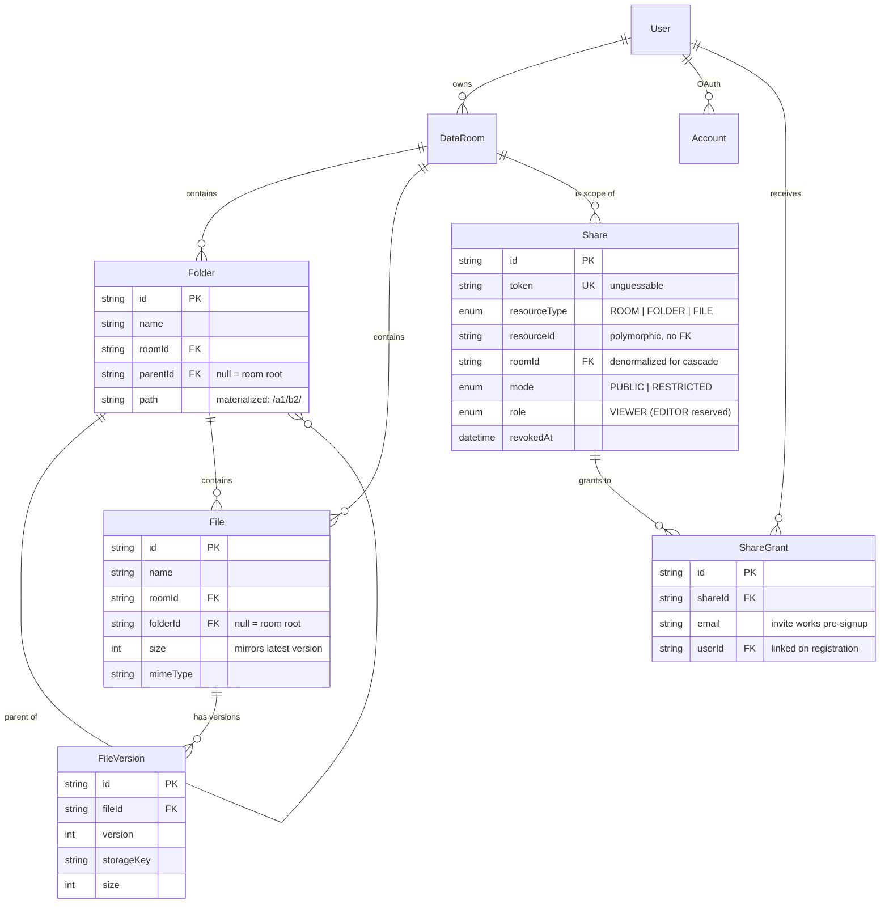

# Strongroom — Data Room MVP

A virtual data room for due diligence: organized folders, versioned documents,
and controlled sharing. Built as a take-home project for the Acme Corp.
acquisition scenario.

**Live demo:** _add your Vercel URL here_
**Demo account:** _add after deploying, or register — email/password signup is open_

---

## What's implemented

**Folders**
- Create, nest arbitrarily deep, rename, delete
- Breadcrumb navigation at every level
- Deleting a folder first shows exactly what will go with it (subtree folder
  count, file count, total size), then cascades

**Files**
- Multi-file upload with drag-and-drop and per-file progress
- PDF (and image) preview right in the browser
- Rename with per-folder conflict detection (409 surfaces inline in the dialog)
- Move to any folder via a tree picker — a name clash in the destination is
  resolved with a ` (2)` suffix automatically, and the toast tells you
- Delete (removes all versions from storage too)
- **Versioning on name conflicts** (extra credit): uploading `NDA.pdf` into a
  folder that already has one stacks it as v2 instead of duplicating — the
  table shows a version badge and the file page has a version history with
  per-version downloads

**Sharing**
- Share a whole data room, a folder, or a single file — recipients get
  read-only access to the item and everything nested under it
- Two modes, Google-Drive-style, in one dialog:
  - **Restricted** — invite specific people by email. Invites work even if the
    person has no account yet; the grant links up when they register.
  - **Anyone with the link** — public token URL
- Owner revokes by removing a person or turning link access off; the link dies
  immediately for everyone ("This link is no longer available")
- Viewing a shared item that was deleted mid-browse degrades gracefully to the
  same unavailable screen — deleted, revoked, and never-existed are
  intentionally indistinguishable to visitors
- "Shared with me" page lists everything you've been granted

**Search** (extra credit): name search across the whole room from anywhere in
it, jumping straight to the folder or file.

**Auth**: email/password (bcrypt). Google sign-in is wired and appears
automatically when `GOOGLE_CLIENT_ID`/`GOOGLE_CLIENT_SECRET` are set.

## Stack and key decisions

| Layer | Choice | Why |
|---|---|---|
| App | Next.js 16 (App Router, TS) — one deployable | Backend is API route handlers + server components over Prisma. One Vercel deploy, no cold-start on a separate API host, and the assignment allows any Node framework. |
| DB | PostgreSQL + Prisma | Relational fits the tree + sharing model; Prisma migrations document the schema. |
| Storage | Vercel Blob (prod) / local disk (dev) behind one interface | `lib/storage.ts` is the only file that knows which backend is active. Dev needs zero external services. |
| Auth | Auth.js v5 (credentials + optional Google) | JWT sessions; `session.user.id` drives every ownership check. |
| UI | Tailwind v4 + shadcn/ui (Radix) | Granular components: the file table, dialogs, share dialog, upload panel, breadcrumbs are all reusable pieces — the read-only share view reuses the same `ItemTable` with different action slots. |

Two decisions worth calling out:

1. **Uploads never pass through the server in production.** The browser asks
   `/api/uploads/blob` for a scoped token (ownership of the target room is
   verified server-side), streams the file directly to Blob storage with
   progress events, then registers the metadata via `POST /api/files`. No
   serverless body-size limit, real progress bars. In dev the same flow posts
   to a local-disk route instead.

2. **Downloads always pass through the server.** `GET /api/files/:id/content`
   checks access (owner? valid share token covering this file? restricted
   grant for this signed-in user?) and streams bytes from whichever backend.
   Storage URLs are never handed to clients, so revoking a share actually
   revokes access to content, not just to metadata.

## Data model



- **`Folder.path` is a materialized path** of ancestor ids (`/` for root-level,
  `/<idA>/<idB>/` deeper). A whole subtree is one indexed prefix query —
  no recursive CTE per page view. Folders never move in this MVP, so paths
  never need rewriting; if folder-move ships, it's one transaction rewriting
  descendant prefixes.
- **`Share` is polymorphic** (`resourceType` + `resourceId`): one table, one
  dialog, one permission path for rooms, folders and files. `roomId` is
  denormalized with a real FK so deleting a room cascades to its shares;
  deleting a folder/file explicitly revokes shares pointing into it, and
  `resolveShareByToken` treats a dangling target as revoked anyway.
- **Versions**: the current version is the highest `version` number;
  `File.size` mirrors it so aggregates are a plain `SUM(size)`.

## How it scales

**Total size / item count of a folder including its subtree.**
Today: subtree folder ids come from one `path LIKE 'prefix%'` query on the
`(roomId, path)` index, then one `aggregate` over files with `folderId IN (…)`
(`folders`, `files`, `bytes` — this is exactly what the delete-warning and
stats endpoints do). Room-level totals are a single `GROUP BY roomId`.
At the next order of magnitude: keep cached `totalSize`/`itemCount` columns on
`Folder`/`DataRoom`, updated transactionally (or via an async queue) on
upload/delete/move — each mutation touches only the ancestor chain, which the
materialized path gives us for free. The read path never walks the tree.

**One room with 100,000 files.**
- *Listing*: views already query per-folder (`(roomId, folderId)` index), never
  the whole room, so a huge room only hurts a folder that itself holds
  thousands of items — add cursor pagination (`orderBy (name, id)`, `take` +
  `cursor`) to `listChildren` and an infinite-scroll table; the API shape
  doesn't change.
- *Indexes*: already in place — `(roomId, parentId)`, `(roomId, path)`,
  `(roomId, folderId)`, `(roomId, name)`. For search at that scale, swap
  `contains` for a `pg_trgm` GIN index on `File.name` (Prisma raw migration);
  same endpoint, same UI.
- *Aggregates*: switch from on-read `SUM` to the cached counters above.
- *Uploads*: already direct-to-Blob, so 100k files is a metadata problem, not
  a bandwidth problem.

**Per-user roles (viewer/editor) without remodeling.**
The schema already carries `Share.role` with `EDITOR` reserved in the enum.
Because every mutation route funnels through the same ownership helpers
(`requireOwnedRoom/Folder/File`), the change is: extend those helpers to
accept "owner OR covering share with role EDITOR" (the covering logic already
exists in `shareCoversFolder/File`), and lift the read-only flag in the share
UI. Per-grant role overrides would be one nullable `role` column on
`ShareGrant`. No tables added, none remodeled.

## Edge cases handled

- Same-name upload → new version (not a duplicate, not an error)
- Rename to a taken name → 409 with the message inline in the rename dialog
- Move into a folder with a name clash → auto ` (2)` suffix, reported in the toast
- "New folder" twice → `New folder (2)` (Finder behavior)
- Deleting a folder/room warns with real subtree stats before anything happens
- Share recipient browsing a folder that just got deleted → clean
  "no longer available" screen, not a 500
- Restricted link opened by the wrong account → explains which account is
  signed in and what to do; opened signed-out → login, then straight back to
  the share
- Invite an email with no account yet → grant activates on registration
- Public/restricted tokens are `crypto.randomBytes` — unguessable, and unknown
  vs revoked vs deleted are indistinguishable from outside
- Upload failures show per-file in the progress panel without killing the batch

## Running locally

Prereqs: Node 20+, pnpm, PostgreSQL running locally.

```bash
pnpm install
cp .env.example .env        # fill DATABASE_URL, AUTH_SECRET (openssl rand -base64 32)
npx prisma migrate dev
pnpm dev
```

Without `BLOB_READ_WRITE_TOKEN`, uploads land in `.uploads/` on disk — the full
flow works with no external services.

## Deploying

1. **Neon** (or any Postgres): create a database, copy the connection string.
2. **Vercel**: import the repo → set env vars `DATABASE_URL`, `AUTH_SECRET`,
   `AUTH_TRUST_HOST=true` → add a **Blob store** (Storage tab; injects
   `BLOB_READ_WRITE_TOKEN` automatically).
3. Run migrations against the prod DB: `DATABASE_URL=… npx prisma migrate deploy`.
4. Optional Google sign-in: create OAuth credentials, set
   `GOOGLE_CLIENT_ID`/`GOOGLE_CLIENT_SECRET`, add
   `https://<your-domain>/api/auth/callback/google` as the redirect URI.

The build command is the default (`next build`; `prisma generate` runs via
`postinstall`).

## Where and how AI was used

I built this with Claude (Claude Code) as a pair programmer, and directed the
work: the product decisions (single deployable, direct-to-blob uploads,
proxied downloads, materialized paths, the polymorphic share model, versioning
semantics) came out of a design discussion I steered, and I reviewed the code
it produced. Claude wrote the bulk of the implementation and the first pass of
this README; testing was done hands-on against a local Postgres — every flow
in "What's implemented" (uploads, versioning, conflicts, share/revoke,
wrong-account and deleted-mid-browse paths) was exercised in a real browser
before it went in. Bugs found in that testing (a Radix `asChild` prop
forwarding issue, hover-only actions being unreachable on touch) were fixed
the same way.
